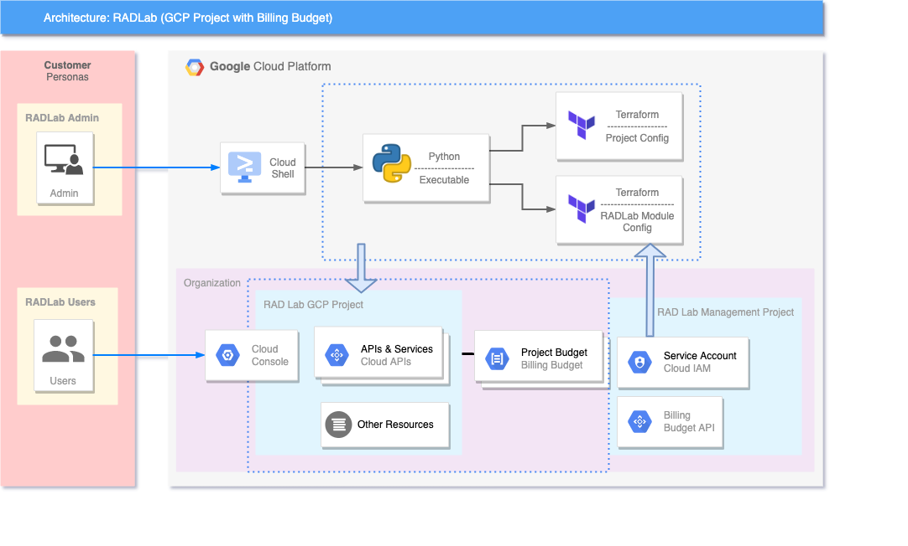

# RAD Lab Billing Budget Module

This module creates a simple GCP project, enables APIs, adds users to the project and also creates a Billing Budget for the Project. 

## GCP Products/Services 

* GCP Project
* APIs & Services
* Billing Budget

## Reference Architecture Diagram

Below Architechture Diagram is the base representation of what will be created as a part of [RAD Lab Launcher](../../radlab-launcher/radlab.py).



## API Prerequisites

In the RAD Lab Management Project make sure that _Cloud Billing Budget API (`billingbudgets.googleapis.com`)_ is enabled.

## IAM Permissions Prerequisites

Create a Terraform Service Account in RAD Lab Management Project to execute / deploy the RAD Lab module. Ensure that the Service Account has the following IAM permissions, **when creating the project** (`create_project` = true): 

- Parent: `roles/resourcemanager.projectCreator`
- Parent: `roles/billing.user`
- Parent: `roles/billing.costsManager` 

The User, Group, or Service Account who will be deploying the module should have access to impersonate and grant it the roles, `roles/iam.serviceAccountTokenCreator` on the **Terraform Service Account’s IAM Policy**.

Note: This is not a Project IAM Binding; this is a **Service Account** IAM Binding.

NOTE: Additional [permissions](../../radlab-launcher/README.md#iam-permissions-prerequisites) are required when deploying the RAD Lab modules via [RAD Lab Launcher](../../radlab-launcher). Use `--disable-perm-check` or `-dc` arguments when using RAD lab Launcher for the module deployment.

_Usage:_

```python3 radlab.py --disable-perm-check```


<!-- BEGIN TFDOC -->
## Variables

| name | description | type | required | default |
|---|---|:---: |:---:|:---:|
| billing_account_id | Billing Account associated to the GCP Resources | <code title="">string</code> | ✓ |  |
| *apis* | The list of GCP apis to enable. | <code title="set&#40;string&#41;">set(string)</code> |  | <code title="">["compute.googleapis.com","bigquery.googleapis.com","bigquerystorage.googleapis.com"]</code> |
| *billing_budget_alert_spend_basis* | The type of basis used to determine if spend has passed the threshold | <code title="">string</code> |  | <code title="">CURRENT_SPEND</code> |
| *billing_budget_alert_spent_percents* | A list of percentages of the budget to alert on when threshold is exceeded | <code title="list&#40;number&#41;">list(number)</code> |  | <code title="">[0.5,0.7,1]</code> |
| *billing_budget_amount* | The amount to use as the budget in USD | <code title="">number</code> |  | <code title="">1000</code> |
| *billing_budget_credit_types_treatment* | Specifies how credits should be treated when determining spend for threshold calculations | <code title="">string</code> |  | <code title="">INCLUDE_ALL_CREDITS</code> |
| *billing_budget_labels* | A single label and value pair specifying that usage from only this set of labeled resources should be included in the budget. | <code title="map&#40;string&#41;">map(string)</code> |  | <code title="&#123;&#125;&#10;validation &#123;&#10;condition     &#61; length&#40;var.billing_budget_labels&#41; &#60;&#61; 1&#10;error_message &#61; &#34;Only 0 or 1 labels may be supplied for the budget filter.&#34;&#10;&#125;">...</code> |
| *billing_budget_services* | A list of services ids to be included in the budget. If omitted, all services will be included in the budget. Service ids can be found at https://cloud.google.com/skus/ | <code title="list&#40;string&#41;">list(string)</code> |  | <code title="">null</code> |
| *create_project* | Set to true if the module has to create a project.  If you want to deploy in an existing project, set this variable to false. | <code title="">bool</code> |  | <code title="">true</code> |
| *enable_services* | Enable the necessary APIs on the project.  When using an existing project, this can be set to false. | <code title="">bool</code> |  | <code title="">true</code> |
| *folder_id* | Folder ID where the project should be created. It can be skipped if already setting organization_id. Leave blank if the project should be created directly underneath the Organization node.  | <code title="">string</code> |  | <code title=""></code> |
| *organization_id* | Organization ID where GCP Resources need to get spin up. It can be skipped if already setting folder_id | <code title="">string</code> |  | <code title=""></code> |
| *project_name* | Project name or ID, if it's an existing project. | <code title="">string</code> |  | <code title="">radlab-billing-budget</code> |
| *random_id* | Adds a suffix of 4 random characters to the `project_id` | <code title="">string</code> |  | <code title="">null</code> |
| *sa* | Terraform Service Account which will be creating the GCP resources | <code title="">string</code> |  | <code title=""></code> |
| *trusted_users* | The list of trusted users who will be assigned Editor role on the project | <code title="set&#40;string&#41;">set(string)</code> |  | <code title="">[]</code> |

## Outputs

| name | description | sensitive |
|---|---|:---:|
| billing_budget_budgetId | Resource name of the budget. Values are of the form `billingAccounts/{billingAccountId}/budgets/{budgetId}` |  |
| deployment_id | RADLab Module Deployment ID |  |
| project-radlab-billing-budget-id | GCP Project ID |  |
<!-- END TFDOC -->
