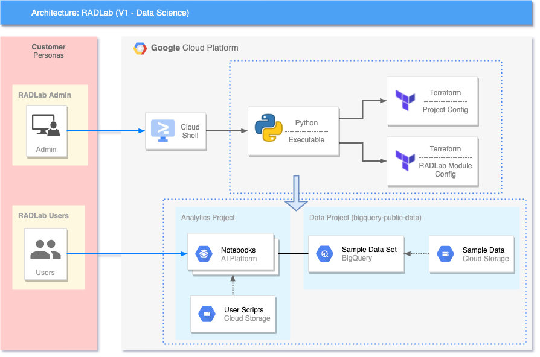

# RAD Lab Data Science Module

## GCP Products/Services 

* AI Platform Notebooks
* BigQuery
* Cloud Storage
* Virtual Private Cloud (VPC)

## Reference Architechture Diagram

Below Architechture Diagram is the base representation of what will be created as a part of [RAD Lab Installer](../../scripts/radlab.py).



## IAM permissions to run the Terraform deployment

The lab need to be deployed by a _Cloud Admin_ persona with the following GCP roles:
* `Billing Account User`
* `Organization Viewer`
* `Project Creator`
* `Storage Object Viewer`
* [OPTIONAL] `Organization Policy Administrator`

## Using Terraform module
Here are a couple of examples to use the module directly in your Terraform code, as opposed to using the RAD Lab Launcher.

### Simple

```hcl
module "simple" {
  source = "./modules/data_science"

  billing_account_id = "123456-123456-123465"
  organization_id    = "12345678901"
  folder_id          = "1234567890"
}
```
### Use existing project

Make sure the identity running the Terraform code has the following IAM permissions on the project:
* `roles/compute.admin`
* `roles/resourcemanager.projectIamAdmin`
* `roles/iam.serviceAccountAdmin`
* `roles/storage.admin`
* `roles/notebooks.admin`

This example assumes that all the necessary APIs have been enabled as well.

````hcl
module "existing_project" {
  source = "./modules/data_science"

  billing_account_id = "123456-123456-123465"
  organization_id    = "12345678901"
  folder_id          = "1234567890"

  create_project  = false
  project_name    = "ds-project-id"
  enable_services = false
  
  set_external_ip_policy          = false
  set_shielded_vm_policy          = false
  set_trustedimage_project_policy = false
}
````

### Existing network
Make sure the identity running the Terraform code has the following IAM permissions on the project:
* `roles/resourcemanager.projectIamAdmin`
* `roles/iam.serviceAccountAdmin`
* `roles/storage.admin`
* `roles/notebooks.admin`

```hcl
module "existing_project_and_network" {
  source = "./modules/data_science"

  billing_account_id = "123456-123456-123465"
  organization_id    = "12345678901"
  folder_id          = "1234567890"

  create_project  = false
  project_name    = "ds-project-id"
  enable_services = false
  enable_services = false
  
  create_network = false
  network_name   = "data-science-network"
  subnet_name    = "data-science-subnetwork"

  set_external_ip_policy          = false
  set_shielded_vm_policy          = false
  set_trustedimage_project_policy = false
}
```

<!-- BEGIN TFDOC -->
## Variables

| name | description | type | required | default |
|---|---|:---: |:---:|:---:|
| billing_account_id | Billing Account associated to the GCP Resources | <code title="">string</code> | ✓ |  |
| organization_id | Organization ID where GCP Resources need to get spin up | <code title="">string</code> | ✓ |  |
| *boot_disk_size_gb* | The size of the boot disk in GB attached to this instance | <code title="">number</code> |  | <code title="">100</code> |
| *boot_disk_type* | Disk types for notebook instances | <code title="">string</code> |  | <code title="">PD_SSD</code> |
| *domain* | Display Name of Organization where GCP Resources need to get spin up | <code title="">string</code> |  | <code title=""></code> |
| *file_path* | Environment path to the respective modules (like DataScience module) which contains TF files for the same. | <code title="">string</code> |  | <code title=""></code> |
| *folder_id* | Folder ID in which GCP Resources need to get spin up | <code title="">string</code> |  | <code title=""></code> |
| *ip_cidr_range* | Unique IP CIDR Range for AI Notebooks subnet | <code title="">string</code> |  | <code title="">10.142.190.0/24</code> |
| *machine_type* | Type of VM you would like to spin up | <code title="">string</code> |  | <code title="">n1-standard-1</code> |
| *notebook_count* | Number of AI Notebooks requested | <code title="">string</code> |  | <code title="">1</code> |
| *random_id* | Adds a suffix of 4 random characters to the `project_id` | <code title="">string</code> |  | <code title=""></code> |
| *set_external_ip_policy* | Enable org policy to allow External (Public) IP addresses on virtual machines. | <code title="">bool</code> |  | <code title="">true</code> |
| *set_shielded_vm_policy* | Apply org policy to disable shielded VMs. | <code title="">bool</code> |  | <code title="">true</code> |
| *set_trustedimage_project_policy* | Apply org policy to set the trusted image projects. | <code title="">bool</code> |  | <code title="">true</code> |
| *trusted_users* | The list of trusted users. | <code title="set&#40;string&#41;">set(string)</code> |  | <code title="">[]</code> |
| *zone* | Cloud Zone associated to the AI Notebooks | <code title="">string</code> |  | <code title="us-east4-c&#10;&#125;&#10;locals &#123;&#10;region &#61; join&#40;&#34;-&#34;, &#91;split&#40;&#34;-&#34;, var.zone&#41;&#91;0&#93;, split&#40;&#34;-&#34;, var.zone&#41;&#91;1&#93;&#93;&#41;">...</code> |

## Outputs

| name | description | sensitive |
|---|---|:---:|
| deployment_id | RADLab Module Deployment ID |  |
| notebooks-instance-names | Notebook Instance Names |  |
| project-radlab-ds-analytics-id | Analytics Project ID |  |
| user-scripts-bucket-uri | User Script Bucket URI |  |
<!-- END TFDOC -->

NOTE: `variables.tf` would list some defaults. If you would like to override or hardcode any variables, please create the `terraform.tfvars` file and set the variables there under each RAD-Lab module's folder.

## Access RAD Lab Data Science Notebooks

Follow the instructions under [gcp-ai-nootbook-tools Readme](../../scripts/gcp-ai-notebook-tools).